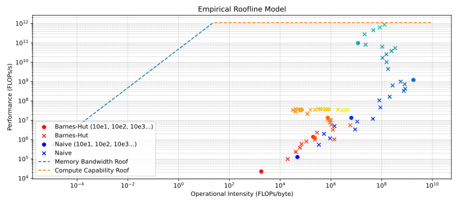
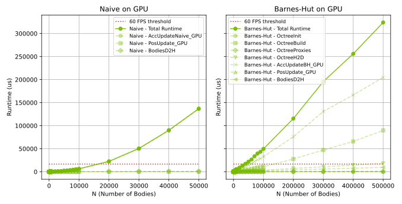
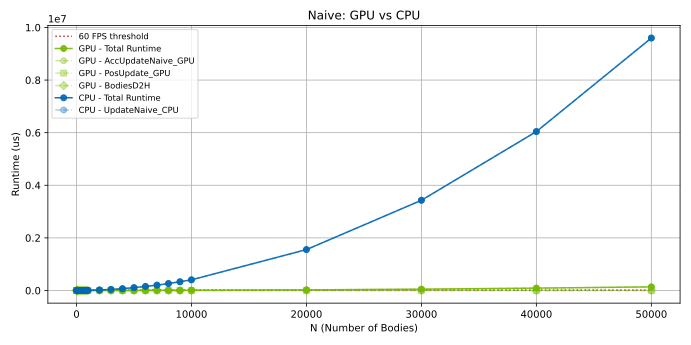
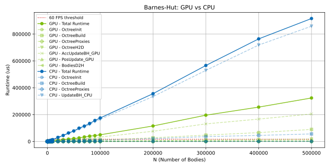

<p align="center">
  
</p>


# GPU Accelerated n-body system

3D nbody simulation using the Naive or Barnes-Hut approximation algorithm on CPU or Nvidia GPU.
A 2D projection of the bodies is rendered _realtime_ with [imgui](https://github.com/ocornut/imgui), [OpenGL](https://www.opengl.org/) and [GLFW](https://www.glfw.org/).
The CPU version also relies on [OpenMP](https://www.openmp.org/).

If a NVIDIA graphics card and CUDA is avilable the computations can be parallelized increasing frame performance significantly.
## Running Instructions
```
git clone https://github.com/benni012/nbody
```

Make sure to update the arch flag according to your systems [Nvidia GPU](https://docs.nvidia.com/cuda/cuda-c-programming-guide/index.html#compute-capability) in CMakeLists.txt (line 67).

```
cmake .
make
```
then everything should be set up to run.
For example 1k particles with the Barnes-Hut algorrithm on the GPU running for 100 iterations: 
```
./nbody -dgpu -abh -n1e3 -i100
```

A detailed explanation of the available arguments
| Option            | Flag       | Argument Type | Description                                   | Default |
|------------------|-----------|--------------|--------------------------------------------------|------------|
| `--benchmark`    | `-b`       | None         | Runs in benchmark mode.                         | `false`    |
| `--device`       | `-d`       | `cpu/gpu`    | Specifies whether to use CPU or GPU.            | `cpu`      |
| `--algo`         | `-a`       | `bh/naive`   | Selects the algorithm (`bh` for Barnes-Hut, `naive` for direct). | `naive` |
| `--num-particles`| `-n`       | Number       | Sets the number of particles.                   | `5000`     |
| `--iters`        | `-i`       | Number       | Defines the number of iterations.               | `UINT_MAX` |
| `--pop-method`   | `-p`       | Number       | Defines the population method (`0` Uniform Disk, `1`, Uniform disk with central mass, `2` Uniform stable disk with movement, `3` Plummers Model) | `3` |
<!-- | `--record`       | `-r`       | None         | Enables recording mode.                         | -->

Benchmark option outputs (and saves to a csv) the average function times, for example:
```
$ ./nbody -anaive -dgpu -n200 -b -i500
Timings:
Function            Calls     Mean Time (us)      Std Dev (us)
BodiesD2H           116       29                  8                   
PosUpdate_GPU       116       9                   1                   
AccUpdateNaive_GPU  116       112                 183                 
```


## Benchmarking
To recreate the benchmarking plots the [Visual Profiler (nvprof)](https://developer.nvidia.com/nvidia-visual-profiler) and Python (>= 3) have to be installed.
Afterwards run:
```
python benchmarks/run_benchmark.py
```

From inside the `/benchmarks` directory, run:
```
python plot_roof.py
```


```
python plot_runtime_vs_time.py
```




 
